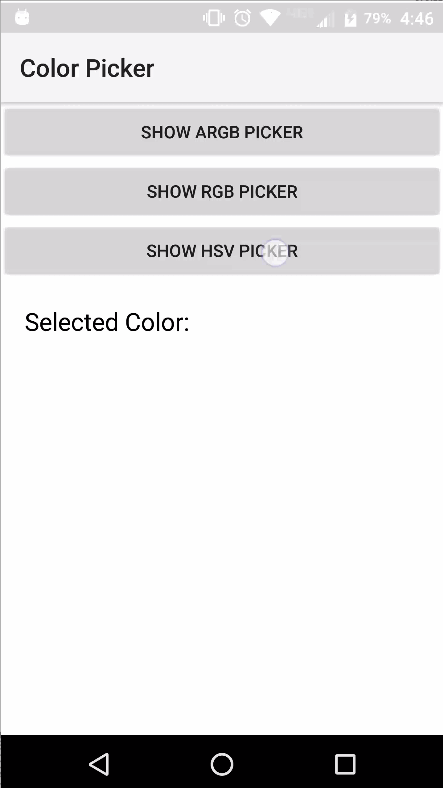
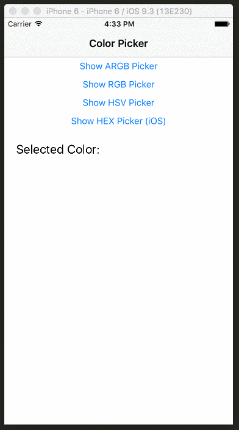

[](https://www.npmjs.com/package/nativescript-color-picker)
[](https://www.npmjs.com/package/nativescript-color-picker)
[](https://travis-ci.org/bradmartin/nativescript-color-picker)
[![Twitter Follow][twitter-image]][twitter-url]

[twitter-image]: https://img.shields.io/twitter/follow/bradwaynemartin.svg?style=social&label=Follow%20me
[twitter-url]: https://twitter.com/bradwaynemartin

# NativeScript Color Picker

NativeScript plugin to show a color picker dialog.

## Sample Usage

| Sample Android                   | Sample iOS                                        |
| -------------------------------- | ------------------------------------------------- |
|  |  |

#### Native Library:

| Android                                                         | iOS                                                     |
| --------------------------------------------------------------- | ------------------------------------------------------- |
| [MrBIMC/VintageChroma](https://github.com/MrBIMC/VintageChroma) | [MSColorPicker](https://github.com/sgl0v/MSColorPicker) |
| ARGB, RGB, HSV                                                  | RGB                                                     |

## Installation

From your command prompt/terminal go to your app's root folder and execute:

`tns plugin add nativescript-color-picker`

## Usage

### XML

```XML
<Page
  xmlns="http://schemas.nativescript.org/tns.xsd" loaded="pageLoaded">
  <ActionBar title="Color Picker" />
  <StackLayout>
    <Button text="Show ARGB Picker" tap="{{ showARGBPicker }}" />
    <Button text="Show RGB Picker" tap="{{ showRGBPicker }}" />
    <Button text="Show HSV Picker" tap="{{ showHSVPicker }}" />
    <StackLayout orientation="horizontal">
      <Label text="Selected Color: " class="message" textWrap="true" />
      <Label text="{{ selectedColor }}" class="message" textWrap="true"/>
    </StackLayout>
  </StackLayout>
</Page>
```

### TS

```TS
import { ColorPicker } from 'nativescript-color-picker';

let picker = new ColorPicker();

 public showARGBPicker() {
    picker.show('#3489db', 'ARGB').then((result) => {
      console.log('color int: ' + result);
    }).catch((err) => {
      console.log(err)
    })
}

```

## API

Opens the color picker dialog.

- **show(initialColor?: string, colorMode?: string): Promise<number>**
  - ColorMode { 'ARGB', 'RGB', 'HSV' }
